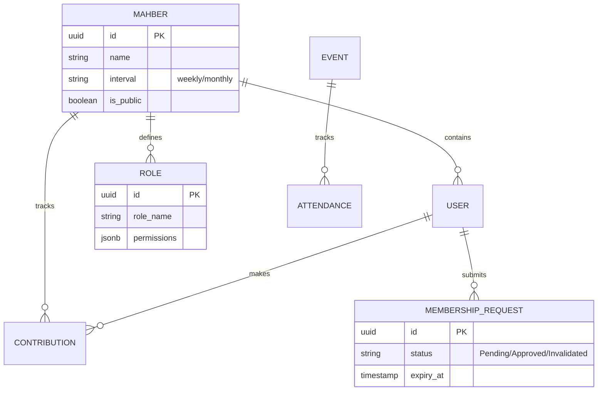
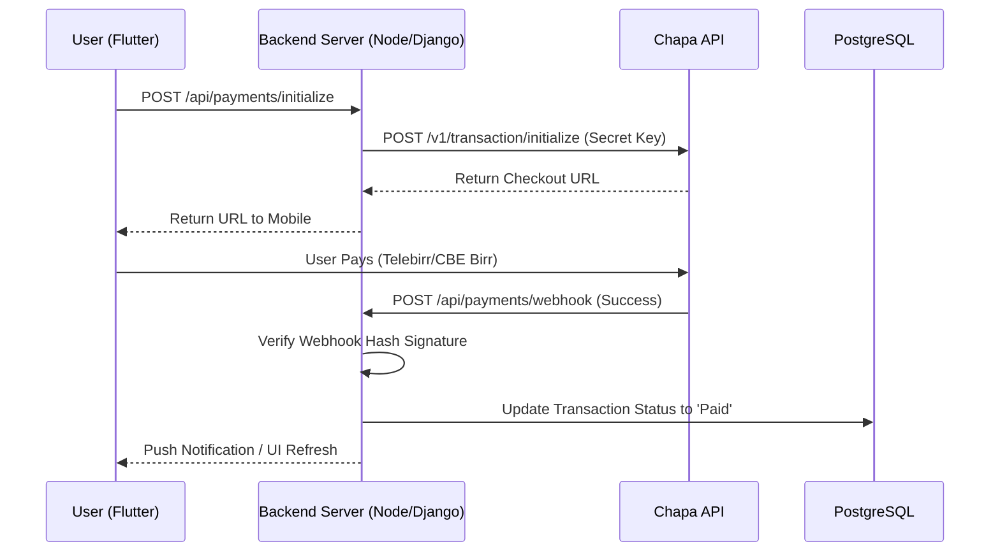
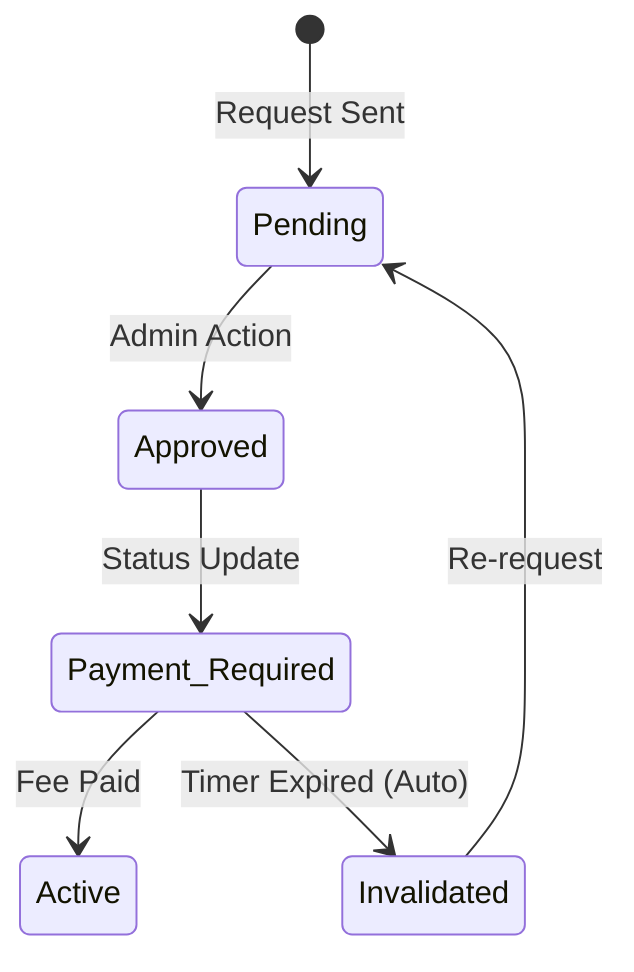

Here is the complete draft of **Chapter 1: Introduction** for your project report. This chapter sets the stage by describing the traditional context of Mahbers in Ethiopia and why a digital solution like **MahberConnect** is necessary.

---

# **Chapter 1: Introduction**

## **1.1 Background of the Study**
In Ethiopia, traditional informal institutions have long served as the backbone of social security and financial inclusion. Among the most prominent are **Iddir**, **Equb**, and **Mahber**. 
* **Iddir:** Functioning as a form of indigenous insurance, Iddirs pool community resources to support members during life-shocks, primarily funerals and medical emergencies. 
* **Equb:** A Rotating Savings and Credit Association (ROSCA) where members contribute a fixed amount at regular intervals (weekly or monthly), and the total sum is awarded to one member per cycle through a lottery system. 
* **Mahber:** Social or religious associations that meet periodically to foster community bonds, provide mutual aid, and celebrate shared values.

For generations, these organizations have operated using a manual, paper-based ledger system known as the **"Dafter."** While effective in close-knit rural settings, these traditional methods face significant challenges in an era of rapid urbanization, digital transformation, and a growing global diaspora. Trust, accountability, and participation are often limited by the physical necessity of attending meetings and the inherent risks of manual record-keeping.

## **1.2 Problem Statement**
Despite their cultural importance, the manual "Dafter" system used by traditional Mahbers suffers from several critical bottlenecks:
1.  **Lack of Transparency:** Members often lack real-time access to financial records, leading to potential mistrust regarding fund management and lottery fairness.
2.  **Inefficiency and Human Error:** Manual data entry is prone to mistakes, and calculating dues, fines, or payouts for large groups is time-consuming and exhausting for administrators (Sebisabis).
3.  **Physical Barriers:** Traditional Mahbers require physical presence for contributions and draws. This excludes the Ethiopian diaspora and professionals with tight schedules who wish to remain connected to their community.
4.  **Risk of Data Loss:** Physical ledgers are susceptible to damage, loss, or theft, which can result in the permanent loss of years of membership and financial history.
5.  **Financial Exclusion:** Because these transactions are "off the books," participants cannot use their years of reliable Equb history to build a credit score or access formal banking services.

## **1.3 Objectives of the Project**

### **1.3.1 General Objective**
The primary objective of this project is to develop **MahberConnect**, a comprehensive monolithic mobile platform designed to digitize, automate, and modernize the management of traditional Ethiopian social and financial institutions (Mahbers, Equbs, and Iddirs).

### **1.3.2 Specific Objectives**
To achieve the general objective, the project focuses on the following:
* **Automate Financial Management:** Implement a digital ledger that tracks contributions, payouts, and fines in real-time.
* **Secure Payment Integration:** Integrate with local payment gateways like **Chapa** to facilitate secure, cashless transactions.
* **Fair Draw Mechanism:** Create a cryptographically secure, automated lottery system for Equb winner selection.
* **Enhance Governance:** Develop a dynamic Role-Based Access Control (RBAC) system for roles like Treasurer and Secretary.
* **Improve Engagement:** Implement real-time communication tools, automated notifications, and QR-based attendance tracking for events.
* **Enable Diaspora Participation:** Provide a remote-access interface that allows users abroad to contribute and stay active in their home communities.

## **1.4 Significance of the Project**
The implementation of **MahberConnect** holds profound significance for both the community and the national economy:
* **For Members:** It provides absolute transparency, security for their savings, and the convenience of participating from anywhere in the world.
* **For Administrators:** It eliminates the "cumbersome Dafter," automating the tedious tasks of fine calculation and record-keeping.
* **For the Economy:** By digitizing the vast amount of cash circulating in the informal "Equb" economy, the system supports Ethiopia’s **Digital 2025 Strategy**, bringing more capital into the formal financial ecosystem and potentially creating a "digital trail" for future credit scoring.

## **1.5 Scope and Delimitations**
### **1.5.1 Scope**
The project covers the development of a cross-platform Flutter application and a centralized monolithic backend. Features include user registration, group creation, automated financial tracking, Chapa payment integration, event management with QR check-ins, and a community voting system.

### **1.5.2 Delimitations**
* The system currently focuses on the Ethiopian domestic and diaspora market, specifically integrated with Ethiopian Birr (ETB) gateways.
* It does not replace the formal banking sector but acts as a bridge for informal community finance.
* Physical presence for "Item-based Equbs" (e.g., car or house delivery) remains outside the digital scope of this version.

## **1.6 Organization of the Report**
This report is organized into five chapters:
* **Chapter 1 (Introduction):** Provides the background, problem statement, and objectives.
* **Chapter 2 (Literature Review):** Analyzes existing systems and the socio-economic context of traditional institutions.
* **Chapter 3 (Requirements Analysis):** Details the functional and non-functional needs of the system.
* **Chapter 4 (System Design):** Describes the architecture, database schema, and API specifications.
* **Chapter 5 (Implementation and Testing):** Documents the development process, UI design, and quality assurance results.

---

### **Visualizing the Concept**
To better understand how the system bridges tradition and technology, consider the following conceptual flow:


# **Chapter 2: Literature Review**

## **2.1 Overview**
The literature review serves as the critical foundation for understanding the intellectual and practical context of the MahberConnect project. [cite_start]It surveys prior work in the field of community management and identifies the specific trends, methodologies, and limitations that shape this study[cite: 574, 575]. [cite_start]This chapter links indigenous Ethiopian social systems such as Iddir, Equb, and Mahber to modern technological frameworks, investigating how digital transformation can preserve traditional structures while significantly improving their operational efficiency and financial transparency[cite: 576, 577, 578].

## **2.2 Review of Related Works**
### **2.2.1 Digital Transformation in the Ethiopian Context**
[cite_start]Recent academic discourse has highlighted the evolution of urban social capital from physical "Dafter" ledgers to digital coordination[cite: 520]. [cite_start]A notable local development is the Edir Management System, which was designed to track member contributions and record funeral-related expenses[cite: 581]. [cite_start]While these systems provided a functional starting point, they often lacked scalability and interoperability, frequently existing as stand-alone desktop applications that were inaccessible to geographically dispersed members[cite: 582]. [cite_start]Furthermore, early attempts at digitizing these associations often neglected robust cloud infrastructure and user-friendly interfaces tailored for non-technical users, which hindered widespread adoption[cite: 583].

### **2.2.2 Global and Regional Community Platforms**
[cite_start]On a global scale, platforms such as Wild Apricot and MemberPlanet have pioneered online membership management and payment processing for NGOs and professional associations[cite: 585, 588]. [cite_start]Additionally, collaboration tools like Slack and Microsoft Teams have demonstrated the power of real-time communication within distributed groups[cite: 586, 590]. [cite_start]However, these international solutions are generally developed for formal Western organizational structures and lack the specialized features required for Ethiopian institutions, such as rotational hosting logic, localized financial rules for Equb lotteries, or multi-language support in Amharic[cite: 589, 591].


## **2.3 Identifying Milestones and Gaps in Literature**
### **2.3.1 Key Milestones**
[cite_start]The progression of literature reveals several technological milestones, starting with the shift from manual entry to automated contribution tracking, which proved the feasibility of digital financial accountability[cite: 587]. [cite_start]The emergence of cloud-based Software-as-a-Service (SaaS) models marked a second milestone, highlighting how community platforms could achieve global scale[cite: 588]. [cite_start]Finally, the integration of real-time communication modules into management tools emphasized the importance of social engagement alongside administrative tasks[cite: 590].

### **2.3.2 Critical Evaluation and Identified Gaps**
Despite these advancements, a critical evaluation reveals significant gaps in current research and existing tools. [cite_start]Most existing Ethiopian solutions focus narrowly on one component of association life, such as finance, while ignoring the social and communicative aspects[cite: 597]. [cite_start]Global platforms remain culturally generic and often require high digital literacy, making them unsuitable for traditional community leaders[cite: 591]. [cite_start]Perhaps most importantly, many community-based platforms store sensitive data without implementing strong security audit mechanisms or role-based access controls, leaving them vulnerable to errors and misuse[cite: 593, 594].


## **2.4 The MahberConnect Synthesis**
[cite_start]MahberConnect is specifically designed to bridge these identified gaps by introducing a holistic, cloud-based ecosystem that unifies membership, finance, events, and communication within a single culturally adaptive framework[cite: 595]. [cite_start]Rather than replacing the traditional Iddir or Equb, the system provides a next-generation management tool that mitigates the administrative difficulties currently leading to the decline of these institutions[cite: 596]. [cite_start]By integrating localized payment gateways like Chapa and implementing a "State-Machine" logic for membership and fines, the system ensures that financial accessibility and accountability remain at the forefront of the user experience[cite: 599, 600].

## **2.5 Lessons Learned from Literatures**
[cite_start]The primary lesson derived from the literature is that for a community platform to be successful, transparency and trust must be built into the code[cite: 598]. [cite_start]This is achieved through the integration of automated audit trails and real-time financial summaries that reflect the physical "Dafter" in a digital format[cite: 598]. [cite_start]Furthermore, the literature emphasizes that the use of cross-platform frameworks like Flutter is essential for reaching members on diverse hardware in resource-constrained environments, ensuring that no member is left behind due to their choice of device[cite: 488].

# **Chapter 3: Requirements Analysis**

## **3.1 Overview**
Requirements analysis is the process of determining the specific needs and expectations of the users and stakeholders for the MahberConnect platform. This chapter identifies the limitations of the current manual system, outlines the features of the proposed digital solution, and categorizes the requirements into functional and non-functional specifications. The goal is to ensure the monolithic system is built to handle the complex social and financial workflows of traditional Ethiopian institutions.

## **3.2 Existing System (The Manual "Dafter")**
The current system relies almost entirely on physical ledgers, known as "Dafters," and face-to-face meetings. A designated administrator (Sebisabi) or secretary (Tsehafi) is responsible for recording contributions, tracking attendance, and managing the lottery pool for Equbs.

### **3.2.1 Limitations of the Manual System**
* **Geographic Dependency:** Members must be physically present to pay dues or witness draws, excluding the diaspora.
* **Calculation Overhead:** Calculating compounding fines for late payments and maintaining a history of winners is prone to human error.
* **Trust Deficit:** Members cannot verify the group's total balance or audit previous transactions without physically requesting the ledger.
* **Inefficient Communication:** Announcements and meeting reminders are sent via phone calls or word-of-mouth, which is inconsistent.

## **3.3 Proposed System**
The proposed system, **MahberConnect**, introduces a centralized monolithic backend that automates these manual processes. It provides a real-time digital ledger, secure remote payments, and automated governance.

### **3.3.1 Key Improvements**
* **Automated Ledger:** Every transaction is recorded instantly and is visible to all authorized members.
* **Cashless Integration:** Using Chapa, members can pay from anywhere via mobile money (Telebirr/CBE Birr).
* **State-Driven Automation:** The system automatically handles "join-request expirations," "payment-cycle reminders," and "fine levying."
* **Digital Presence:** QR-based attendance and shared event galleries allow for a hybrid of physical and digital participation.

## **3.4 Functional Requirements**
Functional requirements define what the system must do. Based on the monolithic architecture and community needs, the requirements are categorized into five modules.

### **3.4.1 Membership and User Management**
* **User Profiles:** The system shall allow users to register with a phone number and maintain a profile.
* **Join Workflow:** The system shall support public Mahbers (instant join) and private Mahbers (admin approval).
* **Auto-Invalidation:** The system shall automatically invalidate approved join requests if the initial fee is not paid within the creator-defined expiry limit.
* **Role-Based Access:** The system shall allow admins to define roles (e.g., Treasurer, Organizer) with specific permissions.

### **3.4.2 Financial Management**
* **Digital Ledger:** The system shall maintain an immutable record of all contributions, payouts, and fines.
* **Chapa Integration:** The system shall provide a secure interface for processing payments through local gateways.
* **Automated Fines:** The system shall automatically calculate and apply fines for late payments based on the Mahber's configuration.
* **Equb Lottery:** The system shall execute a secure random draw for Equb winners from a pool of eligible (paid) members.

### **3.4.3 Event and Attendance Management**
* **Event Scheduling:** The system shall allow organizers to create mandatory or optional events.
* **QR Attendance:** The system shall generate time-sensitive QR codes for members and allow admins to scan them for check-in.
* **Absence Penalties:** The system shall automatically levy fines for missed mandatory events.
* **Shared Galleries:** The system shall provide a photo-sharing space for members after an event is concluded.

### **3.4.4 Communication and Decision Making**
* **Announcements:** Admins shall be able to broadcast priority messages to all members.
* **Real-time Chat:** The system shall provide a group chat feature for social interaction.
* **Voting System:** The system shall allow members to vote on community proposals and view real-time results.

## **3.5 Non-functional Requirements**
* **Security:** The system shall use JWT for session security and ensure that data is isolated between different Mahbers.
* **Availability:** The backend shall be accessible 24/7 to accommodate members in different time zones (Diaspora).
* **Reliability:** Automated tasks (fines, expirations) must execute accurately and handle database transaction failures gracefully.
* **Usability:** The mobile interface shall support the Amharic language and follow a simple navigation structure for users with low digital literacy.

## **3.6 System Modeling (Use Case Diagram)**

The following diagram illustrates the primary interactions between different actors (Admin, Member, System) and the MahberConnect platform.

**Fig 3.1: Use Case Diagram for MahberConnect**
```mermaid
useCaseDiagram
    actor "Member" as M
    actor "Admin" as A
    actor "System Worker" as S

    package "MahberConnect System" {
        usecase "Join Mahber" as UC1
        usecase "Pay Contribution" as UC2
        usecase "Scan Event QR" as UC3
        usecase "View Ledger" as UC4
        usecase "Approve Requests" as UC5
        usecase "Define Roles" as UC6
        usecase "Levy Fines (Auto)" as UC7
        usecase "Run Equb Draw" as UC8
    }

    M --> UC1
    M --> UC2
    M --> UC3
    M --> UC4

    A --> UC5
    A --> UC6
    A --> UC4

    S --> UC7
    S --> UC8
```

## **3.7 Requirements Validation**
To ensure these requirements are met, the development process will follow an iterative approach. Each module (Finance, Membership, Events) will undergo unit testing to verify that the monolithic logic correctly implements the "State-Machine" transitions and automated fine calculations before the final integration phase.

# **Chapter 4: System Design**

## **4.1 Overview**
The system design phase transforms the functional and non-functional requirements identified in Chapter 3 into a technical blueprint. This chapter defines the architectural style, subsystem decomposition, database schema, and security protocols for MahberConnect. By transitioning from a manual, paper-based "Dafter" system to a cloud-integrated platform, the design focuses on ensuring data integrity, financial transparency, and ease of use for diverse community groups in the Ethiopian context.

## **4.2 Design Objectives**
Following the standards of modern community-based software, the design is guided by four primary pillars. First, data integrity is maintained to ensure financial records are immutable and consistent through the use of PostgreSQL transactions. Second, security and isolation are achieved via a robust backend filtering system to prevent data leakage between different Mahbers. Third, the architecture is built for reliability, utilizing a monolithic server model that manages complex state transitions. Finally, the system fosters trust and transparency by providing a digital audit trail for all contributions and payouts, mimicking the accountability of traditional physical meetings.

## **4.3 System Architecture**

### **4.3.1 Proposed Software Architecture**
MahberConnect utilizes a **Monolithic Architecture**. This approach centralizes all business logic, authentication, and database management into a single, cohesive backend server. The Client Tier consists of a cross-platform Flutter application managing the user interface and local state. The Backend Server acts as a RESTful API provider, handling complex workflows such as membership approvals, payment verification via the Chapa gateway, and automated task scheduling for fines and Equb draws.


### **4.3.2 Subsystem Decomposition**
The system is logically divided into several primary modules. The **Identity Subsystem** handles member registration and JWT session management. The **Governance Subsystem** manages configurable roles and permissions. The **Financial Ledger Subsystem** coordinates the core database tables for contributions and automated Equb lotteries. The **Event Subsystem** utilizes QR-based logic for attendance and gallery management. Finally, the **Automation Subsystem** runs background workers to handle join-request expirations and fine levying.

---

## **4.4 Database Design**
The database utilizes a relational PostgreSQL schema designed for multi-tenancy. Every record is tied to a specific `mahber_id` to ensure that group data remains strictly isolated.

### **4.4.1 Entity Relationship Diagram (ERD)**
The diagram below illustrates the relationships between core entities, highlighting how roles and membership requests are integrated into the Mahber structure.

**Fig 4.1: Entity Relationship Diagram**



### **4.4.2 Data Dictionary**
The `Mahbers` table uses a UUID primary key and includes fields for the contribution interval, join fees, and a public/private toggle. The `Users` table stores legal names and unique phone numbers. The `Membership_Requests` table is a state-tracking entity that records the status of an applicant and the `expiry_at` timestamp for their join-fee payment. The `Roles` table stores dynamic permissions in a JSONB format, allowing the creator to customize access for Treasurers, Secretaries, and Organizers.

---

## **4.5 System Integration (Payment Flow)**
The integration with **Chapa** utilizes a secure serverless webhook pattern. This ensures that the backend is updated automatically via a server-to-server callback even if the user closes the app. When a user initiates a payment, the Backend Server requests a checkout URL from Chapa. Once the user pays via Telebirr or CBE Birr, Chapa sends a webhook notification which the Server verifies before updating the ledger.

**Fig 4.3: Sequence Diagram for Monolithic Payment Integration**


---

## **4.6 Detailed Design & Automation Logic**

### **4.6.1 Membership State Machine & Expiry**
To maintain administrative efficiency, the system implements an auto-invalidation workflow. When a creator sets an expiry limit, the backend records the timestamp when a membership request is approved. A background service monitors these records; if the join fee remains unpaid beyond the limit, the system automatically invalidates the request.

**Fig 4.4: Membership State Machine Flow**



### **4.6.2 Automated Fine Calculation**
The backend monitors contribution cycles using a scheduled "Fine Worker." If a member fails to pay within the Mahber’s configured grace period, the worker calculates the penalty based on the penalty rate set by the creator. This fine is appended to the member’s balance and must be cleared to maintain eligibility for the Equb draw.

### **4.6.3 QR-Based Attendance and Event Lifecycle**
The system utilizes time-sensitive, cryptographically signed QR codes. When scanned by an admin, the backend verifies the signature and records the attendance. Mandatory events are linked to the fine system; if a member is absent without excuse, the system automatically issues an "Absence Fine." After the event is marked "Finished," the shared gallery opens for media uploads.

---

## **4.7 Security Design**
MahberConnect implements a security-in-depth approach. Authentication is handled via JWT, ensuring each request is verified. Authorization is enforced through a **Dynamic Role-Based Access Control (RBAC)** middleware that checks a user's role against the Mahber’s permission settings (stored in JSONB) before executing any business logic. This ensures that while a Treasurer can view financial logs, they may be restricted from managing the Event Gallery unless explicitly permitted by the group creator.


## **4.8 Hardware and Software Mapping**
The software is designed to run on mobile handsets with a minimum of 2GB RAM and Android 8.0 or iOS 12.0. The monolithic backend is deployed on a Virtual Private Server (VPS) managing the PostgreSQL instance and a Node.js or Python runtime. A stable internet connection (3G/4G) is required for real-time synchronization, payment verification, and pushing notifications via Firebase Cloud Messaging.

## **4.9 Design Constraints and Trade-offs**
The design involves key trade-offs, such as choosing a monolithic structure to simplify the management of complex, multi-table state transitions at the cost of modular independent scaling. Additionally, the use of a centralized ledger provides absolute transparency but requires the server to handle high-frequency "Heartbeat" tasks—such as checking for expirations and calculating fines—to maintain system-wide automation.